# CS5670 Computer Vision

## Project 2: Feature Detection & Matching 

### Introduction

Detecting image features and matching pairing features across images.

* Feature detection using Harris
* Feature description (simple and MOPS)
* Feature matching (SSD and ratio)

Detailed project description can be found [here](http://www.cs.cornell.edu/courses/cs5670/2024sp/projects/pa2/index.html).

### Steps

1. Compute Harris corner strength at each pixel for source image
2. Find local maxima 
3. Implement Simple Feature Descriptor and MOPS (Multi-Scale Oriented Patches) Descriptor
4. Perform feature matching with  SSD or ratio distance
5. Benchmark the performance of the different descriptors and matching functions in an ROC curve
  
### Structure

| Name                  | Function                                           |
| ------------          | -------------------------------------------------- |
| /resources            | Images used for feature matching                   |
| features.py           | Feature detection, description and matching        |
| featuresUI.py         | Gui to visualize feature matches and benchmarks    |
| tests.py              | Test cases provided to test and debug our code     |
| transformations.py    | Image transformation functions                     |
| benchmark.py          | Code to create ROC curves                          |

#### Libraries used

* matplotlib=3.8.0
* numpy=1.21.5
* opencv=4.6.0
* pillow=10.0.1
* py-opencv=4.6.0
* pyparsing=3.0.9
* python=3.9
* pyttk=0.3.2
* scipy=1.7.3
* tk=8.6.12

### Result

### 1. Yosemite

#### Input

|   |   |
| ------------------------------------------------------------ | ------------------------------------------------------------ |

#### Detected features

Without adjusting the threshold, there were 1559 keypoints found

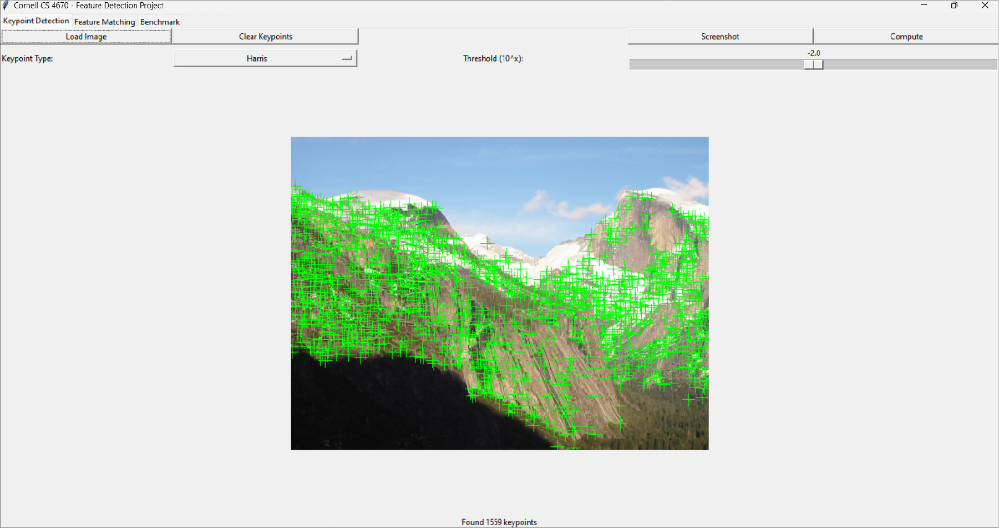     

By adjusting the threshold to-1.5, the keypoints is lowered to 942

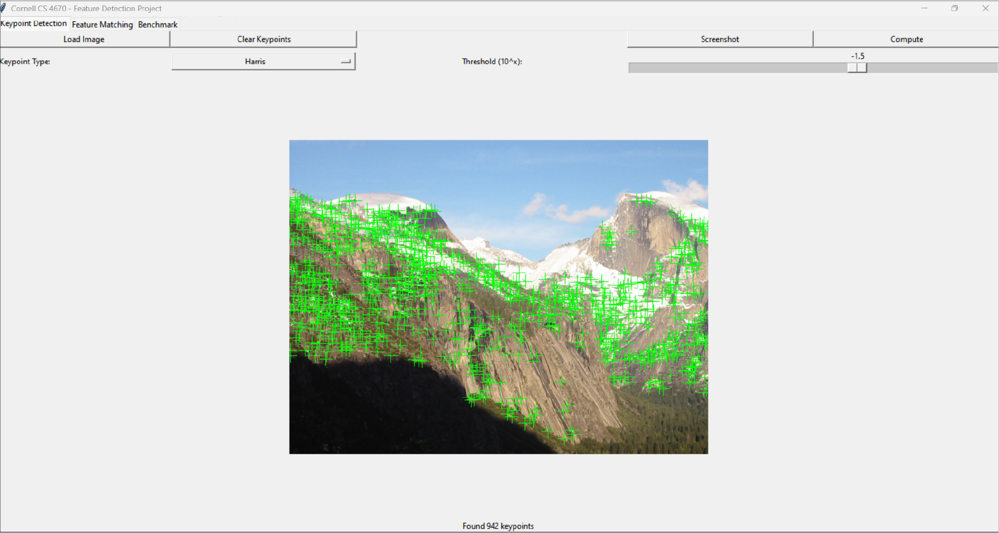

### 2. Custom Image Feature Matching

#### Input

| 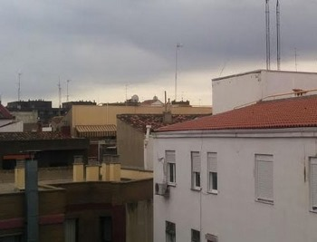    | 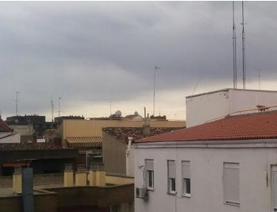 
| ---------------------------------------------------------------- | --------------------------------------- |

#### Matched features

The feature matching computed 85 matches

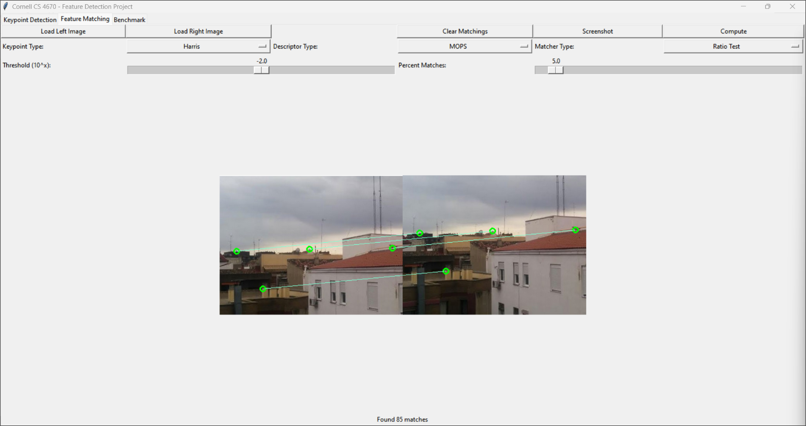     

As the threshold is lowered to-3.2 from-2.0, the number of matches improves (226 matches) as shown below but there are more matches that can be shown that are not matching properly

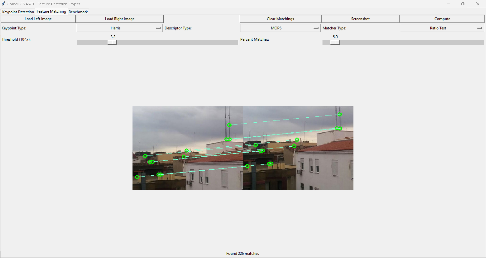

### 3. Performance Benchmark

We can see a huge improvement in the AUC when we do MOPS with the Ratio Test v. MOPS with SSD. Our team believes that The ratiotest performs a lot better than the SSD because the features on the rock has similar patterns and the ratio distance test enables greater matching. Also, there is a minor improvement between Simple with SSD and Simple with the Ratio Test (~0.2), which is not as significant as the changes with the MOPS above.

|  MOPS with Ratio (Threshold: $10^{-2}$) | MOPS with SSD (Threshold: $10^{-2}$) |
| ------------------------------------------------------------ | ------------------------------------------------------------ |
|  Result: Avg Distance: 332, Avg AUC: 0.9038 | Result: Avg Distance: 332, Avg AUC: 0.7987 |
| 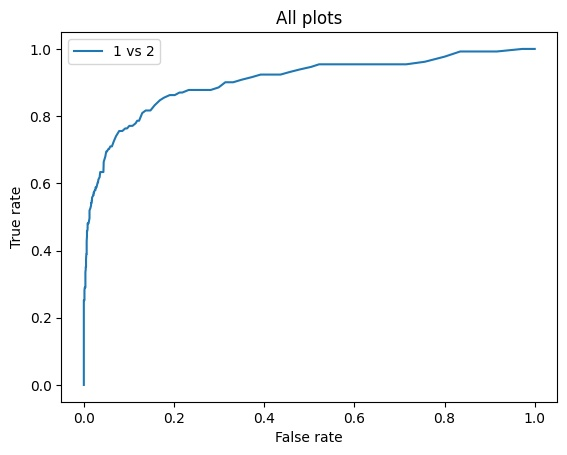  | 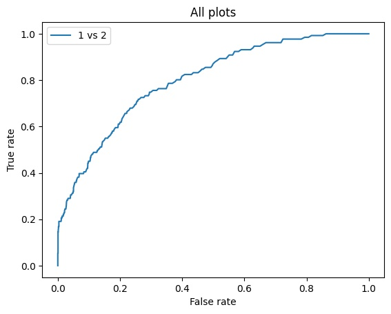  |

| Simple with SSD ROC Curve (Threshold: $10^{-2}$) | Simple with Ratio ROC Curve (Threshold: $10^{-2}$) |
| ------------------------------------------------------------ | ------------------------------------------------------------ |
|   Result: Avg Distance: 269, Avg AUC: 0.8782 |  Result: Avg Distance: 269, Avg AUC: 0.8947 |
| 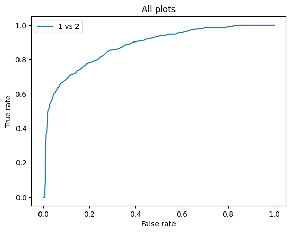    |  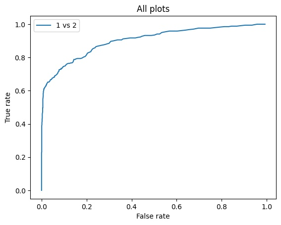  |

### 4. SIFT for scale invariant descriptor

For the scale invariant descriptor, our team tried to implement the method mentioned in the project guide, which was using various scales (Gaussian pyramid) and selecting the best descriptor by ANMS (adaptive non maximal suppression). However, the performance did not improve more than 15%, due to the lack of successful implementation.

Based on the lecture, our team came up with implementing a simple version of the SIFT, which is currently the state-of-art descriptor. Implementing SIFT was much more straightforward and robust, considering the superb performance that we will talk about in the following paragraphs.

The `CustomFeatureDescriptor` class is located in the [features_scale_invariant.py](./bonus/features_scale_invariant.py) file at **line 413**.

#### Steps for Our SIFT

1. **Preprocessing:**
   - Convert the image to a floating-point data type and normalize it to ensure consistency in feature computation across images with varying brightness levels.
   - Convert the image to grayscale to focus on intensity gradients.

2. **Gradient Calculation:**
   - Compute the gradient for each keypoint using the Sobel operator to calculate the gradients along the x and y axes. This helps in determining the orientation and edge directions within the image.

3. **Keypoint Detection:**
   - Detect keypoints by feeding the values into the algorithm.
   - Construct a 16x16 window around each keypoint to focus on local image information.

4. **Create Sub-regions for Keypoint Descriptors:**
   - Divide the 16x16 window into 16 smaller 4x4 sub-regions.
   - Compute an 8-bin orientation histogram for each sub-region, capturing both the magnitude and orientation of gradients within that region.

5. **Apply Gaussian Weighting:**
   - Apply a Gaussian window to weight the gradient magnitudes, giving more importance to gradients closer to the keypoint center.

6. **Construct the Feature Descriptor:**
   - Concatenate the histograms from all 16 sub-regions to form a 128-element feature vector for each keypoint, ensuring that the descriptor is scale-invariant.

7. **Normalize the Descriptor:**
   - Normalize the 128-element feature vector to unit length to handle variations in lighting and contrast effectively.

8. **Feature Matching using Nearest Neighbor and Ratio Test:**
   - Match descriptors between images by performing nearest-neighbor matching. Use the ratio test to discard ambiguous matches and improve the robustness of feature matching.

#### Performance Benchmark for SIFT

ROC curve and AUC by our custom SIFT algorithm (Yosemite dataset)

SIFT with Ratio (Threshold: $10^{-2}$): Avg Distance: 236, Avg AUC: 0.9830

  

SIFT with Ratio (Threshold: $10^{-2.5}$): Avg Distance: 219, Avg AUC: 0.9869 &rarr; **Highest Performance**

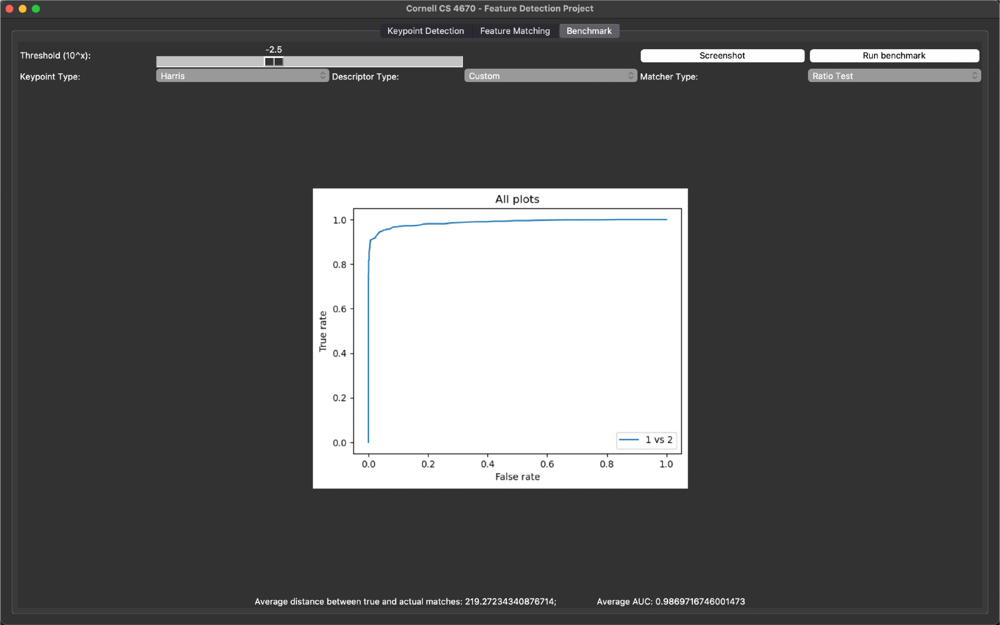

#### Matched features

Yosemite dataset Feature Matching with Custom Descriptor (Threshold: $10^{-2.5}$) (4.9%): 2004 matches
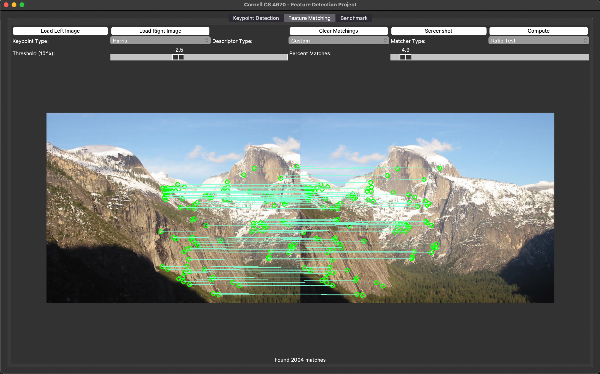     

Custom Image Feature Matching with Custom Descriptor (Threshold: $10^{-2.5}$) (23.6%): 141 matches
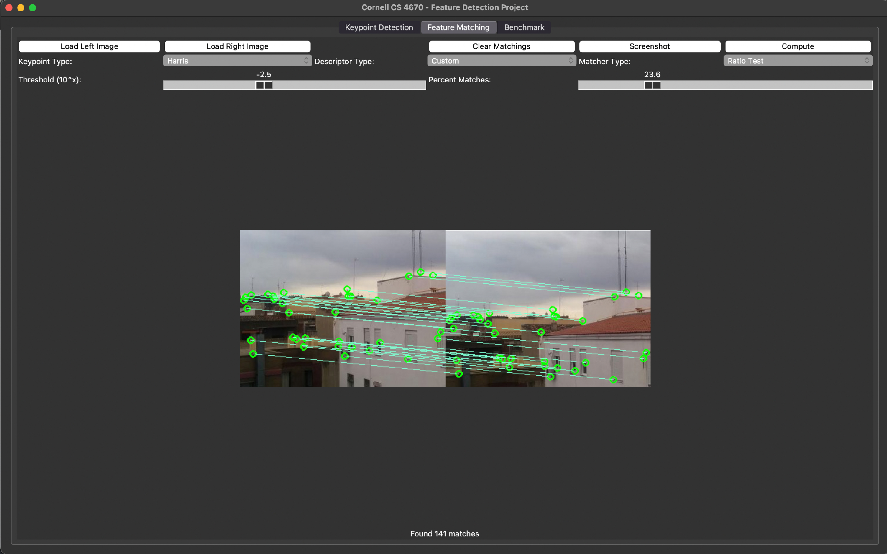